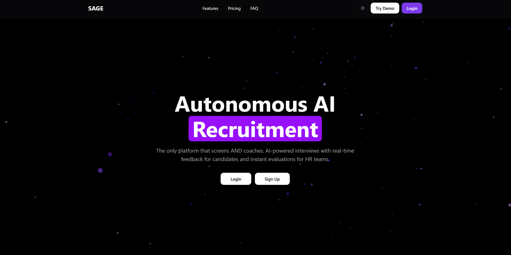
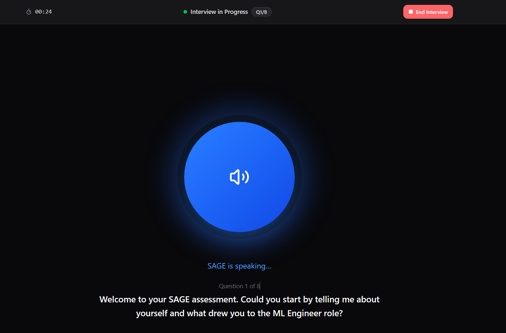
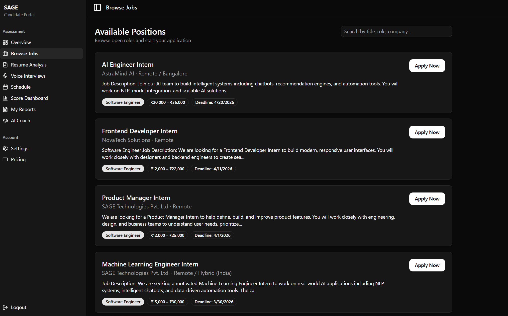
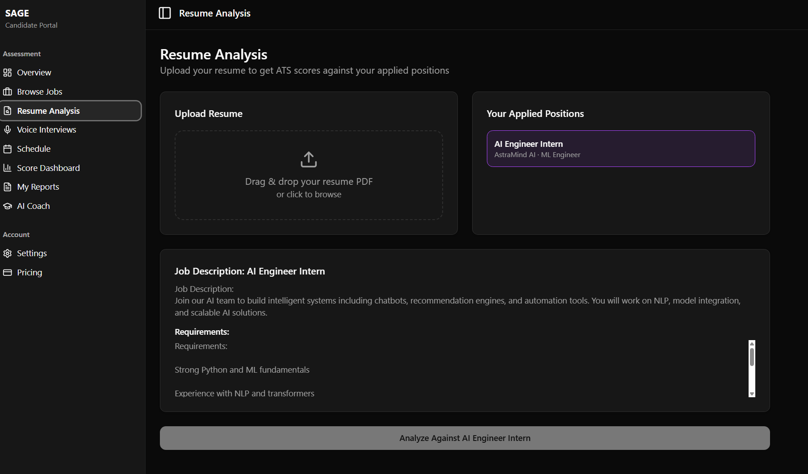
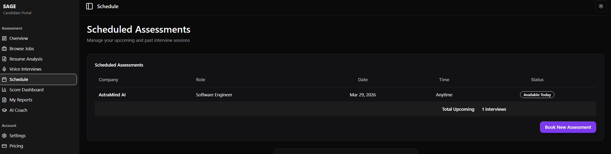
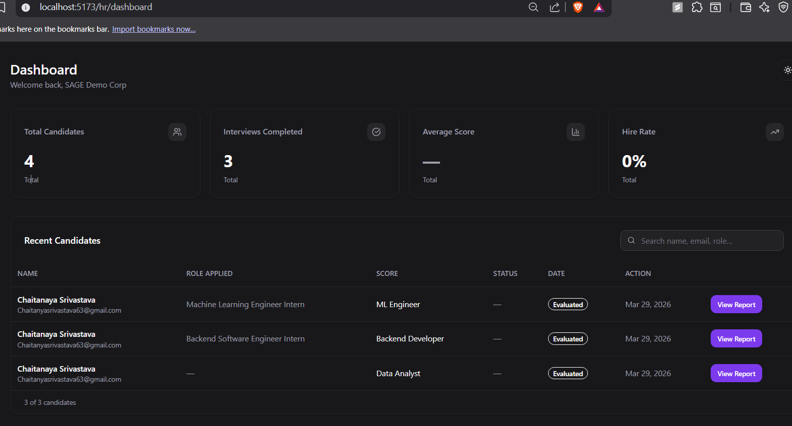
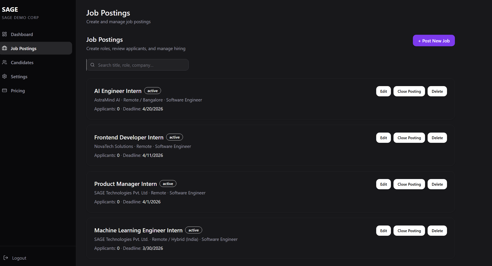
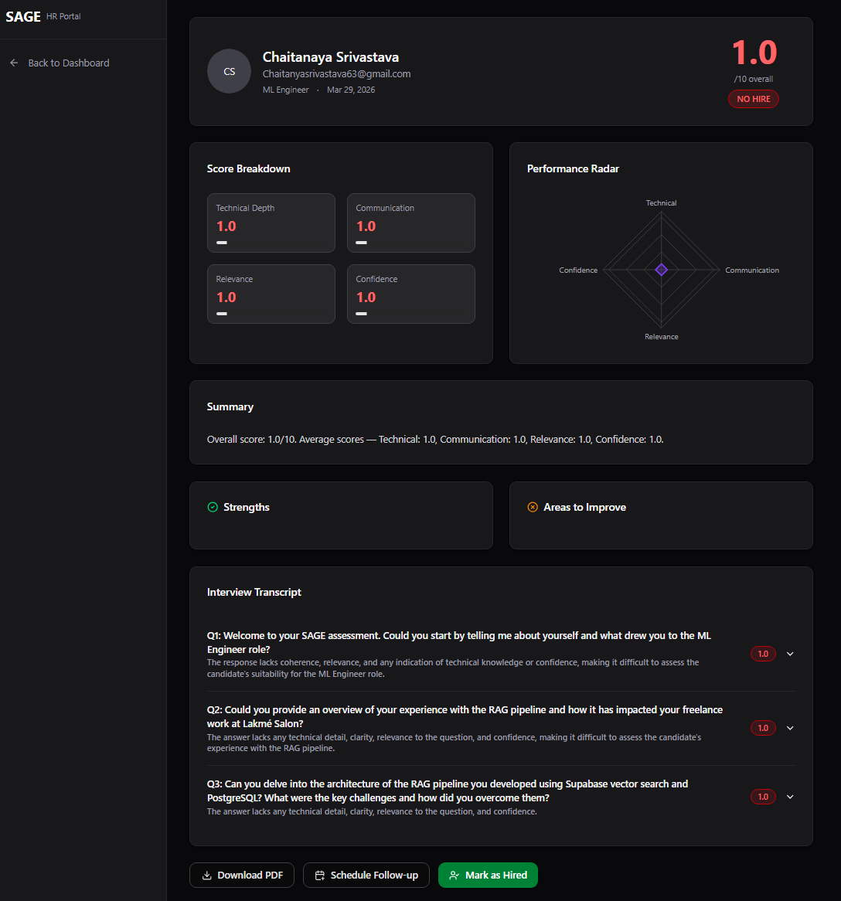
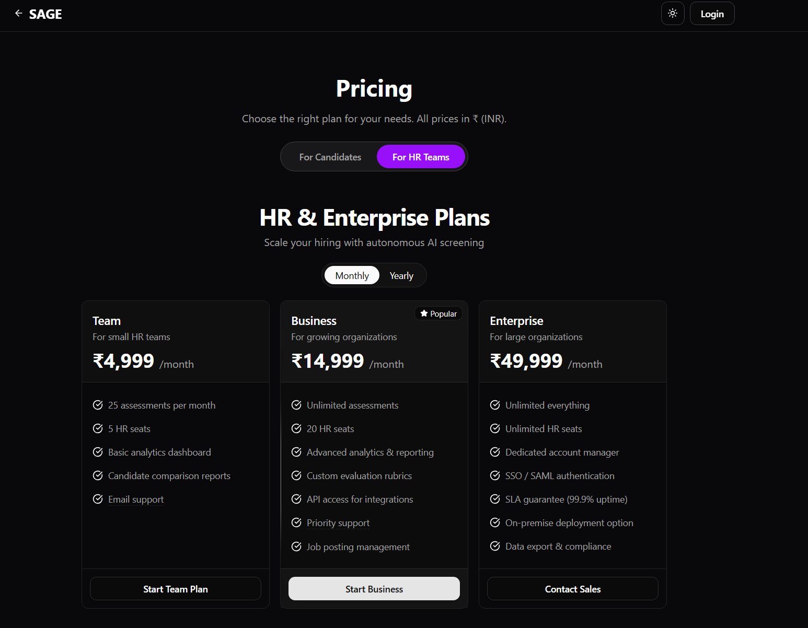

<p align="center">
  <h1 align="center">SAGE — Smart Agentic Grading & Evaluation System</h1>
  <p align="center">Autonomous AI-powered recruitment platform that screens AND coaches candidates</p>
</p>

<p align="center">
  
  
  
  
  
  
  
  
</p>

---

## The Problem

Hiring is broken on both sides:
- **HR teams** spend ~23 hours per hire on manual screening, scheduling, and evaluation
- **Candidates** receive zero feedback — they interview into a void and never know what to improve

Existing tools like Whitecarrot, HireVue, and Lever only solve the HR side. No platform helps candidates get better.

## The Solution

SAGE is the **first platform that both screens AND coaches**. It conducts fully autonomous AI voice interviews, evaluates candidates across 4 dimensions, and provides actionable improvement feedback — all without a single human in the loop.

---

## Screenshots

### Landing Page


### AI Voice Interview


### Candidate Dashboard


### Resume Analysis with Radar Chart


### Interview Scheduling


### HR Dashboard


### HR Job Postings


### Candidate Evaluation Report


### Pricing


---

## Architecture

```
┌─────────────────────────────────────────────────────────┐
│                    SAGE Architecture                     │
├─────────────────────────────────────────────────────────┤
│                                                         │
│  Frontend (React + Vite + TypeScript)                   │
│  ├── Landing Page with Particles Background             │
│  ├── Candidate Dashboard (shadcn Sidebar)               │
│  ├── HR Dashboard (shadcn Sidebar)                      │
│  ├── Voice Interview UI (WebSocket + CSS Orb)           │
│  └── Resume Analysis (Radar Charts)                     │
│                                                         │
│  Backend (FastAPI + LangGraph)                          │
│  ├── 5-Agent Pipeline:                                  │
│  │   ├── Resume Parser Agent                            │
│  │   ├── Question Generator Agent (GPT-4o)              │
│  │   ├── Voice Interviewer (Deepgram STT + ElevenLabs)  │
│  │   ├── Response Evaluator Agent (GPT-4o)              │
│  │   └── Report Generator Agent                         │
│  ├── WebSocket Handler (real-time voice loop)           │
│  └── REST API (auth, CRUD, file upload)                 │
│                                                         │
│  Database (Supabase PostgreSQL)                         │
│  ├── candidates, interviews, questions                  │
│  ├── responses, reports, hr_users                       │
│  └── job_postings                                       │
│                                                         │
└─────────────────────────────────────────────────────────┘
```

## 5-Agent LangGraph Pipeline

| Agent | Role | Technology |
|-------|------|------------|
| **Resume Parser** | Extracts skills, experience, education from PDF | PyPDF2 + GPT-4o |
| **Question Generator** | Creates 8 personalized interview questions | GPT-4o |
| **Voice Interviewer** | Real-time speech-to-text and text-to-speech | Deepgram Nova-2 + ElevenLabs |
| **Response Evaluator** | Scores answers on 4 dimensions (1-10 each) | GPT-4o |
| **Report Generator** | Produces final evaluation with recommendation | GPT-4o |

### Scoring Dimensions
- **Technical Depth** (35%) — domain knowledge and implementation understanding
- **Communication** (25%) — clarity, structure, and articulation
- **Relevance** (25%) — how well answers address the question
- **Confidence** (15%) — delivery, conviction, and composure

---

## Features

### For Candidates
- **Browse Jobs** — View and apply to HR-posted positions
- **AI Voice Interview** — Real-time voice interview with auto-listen
- **Resume Analysis** — ATS scoring against job descriptions with radar charts
- **Schedule Interviews** — Book within HR-set deadlines
- **AI Coach** — Personalized improvement tips after every interview
- **Score Dashboard** — Track performance across interviews

### For HR Teams
- **Post Jobs** — Create job listings with descriptions and deadlines
- **Candidate Management** — View all applicants with scores and status
- **Evaluation Reports** — Detailed reports with radar charts and transcripts
- **Hire/Reject** — Make decisions that update candidate status in real-time

---

## Tech Stack

| Layer | Technology |
|-------|-----------|
| Frontend | React 19, Vite, TypeScript, Tailwind CSS, shadcn/ui |
| Backend | FastAPI, LangGraph, Python 3.11 |
| AI/ML | OpenAI GPT-4o, Deepgram Nova-2 STT, ElevenLabs TTS |
| Database | Supabase (PostgreSQL) |
| Auth | JWT (python-jose) |
| Real-time | WebSocket (FastAPI + browser MediaRecorder API) |

---

## Quick Start

### Prerequisites
- Python 3.11+
- Node.js 18+
- Supabase account with project set up

### Backend
```bash
cd backend
pip install -r requirements.txt
# Create .env with your API keys (see .env.example)
python -m uvicorn main:app --reload --port 8000
```

### Frontend
```bash
cd frontend
npm install
npm run dev
```

### Environment Variables (backend/.env)
```
OPENAI_API_KEY=your_key
DEEPGRAM_API_KEY=your_key
ELEVENLABS_API_KEY=your_key
ELEVENLABS_VOICE_ID=21m00Tcm4TlvDq8ikWAM
SUPABASE_URL=your_url
SUPABASE_KEY=your_anon_key
JWT_SECRET=your_secret
```

---

## API Endpoints

| Method | Endpoint | Description |
|--------|----------|-------------|
| POST | `/api/auth/candidate-login` | Candidate login/signup |
| POST | `/api/auth/login` | HR login |
| POST | `/api/auth/hr-signup` | HR registration |
| POST | `/api/upload-resume` | Upload resume + generate questions |
| GET | `/api/jobs` | List active job postings |
| POST | `/api/jobs` | Create job posting (HR) |
| GET | `/api/interviews` | List all interviews |
| GET | `/api/report/{id}` | Get evaluation report |
| GET | `/api/candidates` | List all candidates |
| WS | `/ws/interview/{id}` | Real-time voice interview |

---

## Database Schema

7 tables in Supabase PostgreSQL:
- `candidates` — name, email, resume data
- `interviews` — candidate_id, job_role, status, scores
- `questions` — interview questions with categories
- `responses` — candidate answers with per-question scores
- `reports` — final evaluation with recommendation
- `hr_users` — HR accounts with company info
- `job_postings` — job listings with deadlines

---

## What Makes SAGE Unique

> **SAGE is the only platform that both screens AND coaches.**

| Feature | Traditional ATS | SAGE |
|---------|----------------|------|
| Resume Screening | ✅ | ✅ |
| Interview Scheduling | ✅ | ✅ |
| Voice Interviews | ❌ | ✅ |
| Real-time AI Evaluation | ❌ | ✅ |
| Candidate Feedback | ❌ | ✅ |
| AI Interview Coach | ❌ | ✅ |
| Skill Improvement Tips | ❌ | ✅ |

---

## Team

Built for **VibeCon Hackathon 2025** by:
- **Chaitanya Srivastava** — AI/ML & Backend Lead
- **Akriti Rai** — Frontend & Design
- **Ansh Shrivastav** — Integration & Testing

---

<p align="center">
  <b>SAGE</b> — Smart Agentic Grading & Evaluation System<br/>
  Powered by GPT-4o · Deepgram · ElevenLabs · LangGraph
</p>
